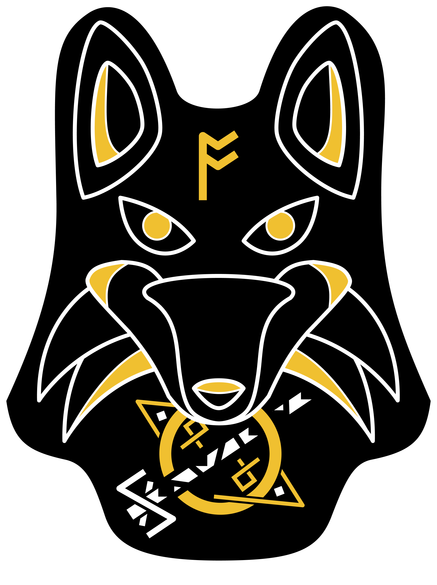

# Ragnakode - Simple Programming Language

<p align="center">
    
</p>


## Overview
Ragnakode is a simple language implemented for academic purposes.
It was created for the *“Developing your first language”* talk with focus in explaining compilers functionality. This is part of *Weekomp II*, an event which occurs every year at **Instituto Federal de Educação, Ciência e Tecnologia do Ceará (IFCE) -  Campus Fortaleza**. The event is promoted by veteran/alumni students of the computer engineering course with the objective of engaging the newcomers students to the course.

## Map
- [Web Page](https://ragnakode.herokuapp.com/)
- [Slides](dist/resources/talk-slides.pdf)
- [Compiler Structure](src/compiler)

## Ragnakode Grammar
### Tokens
- **command:** ```STR``` | ```PRT``` | ```SUM``` | ```SUB``` | ```MUL``` | ```DIV```
- **points:** ```/:/```
- **identifier:** ```/[_]*[a-zA-Z][a-zA-Z0-9_]*/```
- **number:** ```/-?(0|[1-9]\d*)(\.\d+)?([eE][+-]?\d+)?/```
- **arg:** **```identifier```** | **```number```**
### Productions
- **instructions** -> *instructions* *instruction* | *instruction*
- **instruction** -> **```identifier points```** *operation*
- **operation** -> **```command```** *args*
- **args** -> **```arg arg```** | **```arg```** | *empty*

## License
The project is licensed by the MIT License - see [LICENSE.md](LICENSE) for more details.
